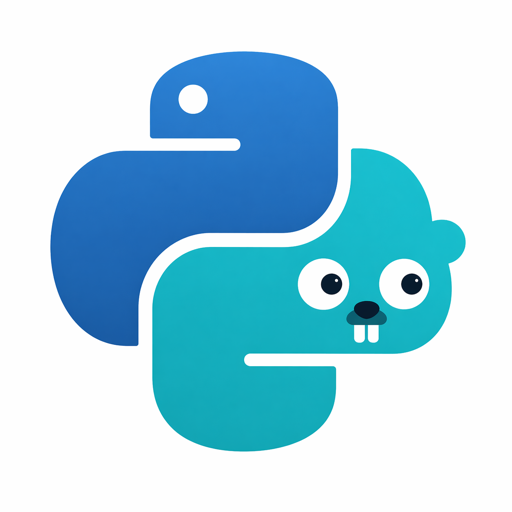

<p align="center">
  
</p>

<h1 align="center">goipy</h1>

<p align="center">Pure-Go interpreter for CPython 3.14 bytecode.<br>One binary. No cgo. No Python on the box.</p>

<p align="center">
  <a href="https://pkg.go.dev/github.com/tamnd/goipy"></a>
  <a href="https://github.com/tamnd/goipy/actions"></a>
  <a href="https://goreportcard.com/report/github.com/tamnd/goipy"></a>
  <a href="LICENSE"></a>
  
  
</p>

```sh
python3.14 -m py_compile hello.py
go run ./cmd/goipy __pycache__/hello.cpython-314.pyc
```

goipy reads a `.pyc` file and runs it. CPython compiles; goipy executes. No shared libraries, no subprocess, no cgo.

## Why

Embedding Python in Go usually means one of three things: ship CPython alongside your binary, link `libpython` via cgo, or run a Python subprocess. All three work. None gives you a single portable binary that executes Python scripts end-to-end.

goipy fills that gap. It takes `.pyc` files produced by CPython 3.14 and runs the bytecode through a Go switch loop, with Python objects modelled as Go values on Go's GC. You lose peak speed and C extensions. You get a single static binary, no install steps on the target, and full control over stdout/stderr in code.

Good fits: services with user-pluggable logic, auditable script payloads, CLI tools that accept small Python scripts as config.

## Quick start

Requires **Go 1.26** and **Python 3.14**.

```sh
cat > hello.py <<'EOF'
name = "goipy"
print(f"hello from {name}")
print(sum(range(10)))
EOF

python3.14 -m py_compile hello.py
go run ./cmd/goipy __pycache__/hello.cpython-314.pyc
```

```text
hello from goipy
45
```

Run the test suite and benchmarks:

```sh
go test ./...
bench/run.sh   # diffs output vs CPython on 24 cases, then times each
```

The benchmark runner fails the sweep if any case diverges from CPython. Fast is worthless if the answer is wrong.

## Embed in Go

```go
import (
    "os"

    "github.com/tamnd/goipy/marshal"
    "github.com/tamnd/goipy/object"
    "github.com/tamnd/goipy/vm"
)

func runPyc(path string) error {
    code, err := marshal.LoadPyc(path)
    if err != nil {
        return err
    }
    i := vm.New()
    i.Stdout = os.Stdout
    i.SearchPath = []string{"./pymodules"} // for import resolution
    _, err = i.Run(code)
    if e, ok := err.(*object.Exception); ok {
        os.Stderr.WriteString(vm.FormatException(e))
    }
    return err
}
```

A few things worth knowing:

- `vm.New()` is cheap. Reuse the interpreter across runs if you want to keep the builtin module cache warm.
- `i.Stdout` and `i.Stderr` are `io.Writer`. Point them at a buffer for tests or at a logger for structured output.
- `*object.Exception` carries a full Python traceback. `vm.FormatException` renders it in the familiar multi-line format, with position underlines.

## What works

| Area | Status | Notes |
|---|---|---|
| `int`, `float`, `bool`, `bytes`, `str` | works | `int` is arbitrary precision via `math/big` |
| `list`, `tuple`, `dict`, `set`, `frozenset` | works | dicts are insertion-ordered |
| Control flow, comprehensions | works | `for`, `while`, `break`, `continue` |
| Functions, closures, decorators | works | positional, keyword, `*args`, `**kwargs`, defaults |
| Classes, MRO, `super()` | works | C3 linearisation |
| Exceptions, tracebacks | works | `try/except/finally`, chained `raise`, exception groups |
| Generators, `yield`, `yield from` | works | goroutine + channel per generator |
| `async`/`await`, `asyncio.run` | works | covers `asyncio.sleep`, `gather` |
| `with` / `async with` | works | `__enter__`/`__exit__`, `__aenter__`/`__aexit__` |
| `match` statement | works | class, sequence, mapping patterns, guards |
| `import` of `.pyc` on disk | works | `Interp.SearchPath` for resolution |
| `pathlib` | works | `PurePosixPath`, `Path`/`PosixPath`, full I/O, glob, rglob, walk, stat |
| `tempfile` | works | `TemporaryDirectory`, `mkdtemp`, `mkstemp`, `gettempdir` |
| Stdlib subset | partial | 60+ modules — sys, math, time, io, json, re, hashlib, datetime, collections, itertools, and more |
| C extensions | no | no `PyObject*` ABI; out of scope |

Stdlib coverage moves the most often. Check `vm/stdlib_*.go` for the current set.

## Performance

Captured 2026-04-21, Apple M4, Go 1.26.2 vs CPython 3.14.4. All 24 cases produce byte-identical output.

| Case | CPython (ms) | goipy (ms) | ratio |
|---|---:|---:|---:|
| arith_bigint | 0.011 | 0.025 | 2.3x |
| arith_float | 20.208 | 45.379 | 2.2x |
| arith_int | 56.981 | 221.974 | 3.9x |
| call_plain | 53.433 | 181.139 | 3.4x |
| class_attrs | 18.541 | 112.161 | 6.0x |
| ctrl_for_range | 131.172 | 439.422 | 3.3x |
| ctrl_while | 8990.356 | 5897.821 | 0.7x |
| gen_yield | 15.991 | 56.486 | 3.5x |
| real_nqueens | 12.184 | 44.305 | 3.6x |
| real_wordcount | 12.483 | 46.696 | 3.7x |

23 of 24 cases land between **2x and 6x** slower than CPython. `ctrl_while` wins because it runs a bignum Fibonacci large enough that Go's `math/big` overtakes CPython's `PyLong`. Full results and methodology: [`bench/RESULTS.md`](bench/RESULTS.md).

## Project layout

```text
cmd/goipy/           CLI: load a .pyc and run it
marshal/             .pyc header + marshal decoder
op/                  opcode table, generated from CPython's opcode.py
object/              Python object model (Int, Str, Dict, Class, Exception, ...)
vm/interp.go         Interp struct; Run, RunPyc, module frame setup
vm/asyncio.go        builtinModule() registry; minimal asyncio event loop
vm/dispatch.go       opcode dispatch switch
vm/call.go           argument binding, *args, **kwargs, defaults
vm/generator.go      generators and coroutines (goroutine + channel)
vm/stdlib_*.go       60+ built-in modules across 38 files (math, re, hashlib,
                     pathlib, tempfile, datetime, collections, ...)
internal/testdata/   145 Python fixtures with expected stdout
bench/               benchmark cases and CPython comparison runner
```

## FAQ

**Why `.pyc` input?**
CPython parses Python correctly and emits stable per-version bytecode. Starting from `.pyc` lets goipy focus on execution, not parsing.

**Can I feed it a `.py` file?**
Compile it first: `python3.14 -m py_compile script.py`. On-the-fly compilation is out of scope.

**What about threads?**
`threading.Thread` is out of scope. Workloads that need real OS threads belong under CPython.

**How does async work?**
`vm/asyncio.go` runs a minimal event loop on Go channels. `asyncio.run`, `sleep`, and `gather` cooperate without any real event loop machinery.

**Is it safe for untrusted code?**
Smaller attack surface than CPython (no C extensions, no JIT), but unaudited. Treat hostile `.pyc` as capable of exhausting memory or CPU even while staying within the guest.

**Why is `arith_int` 3.9x slower?**
`math/big` allocates on every operation. CPython caches small ints. A tagged-pointer small-int fast path would close most of that gap.

More in [ARCHITECTURE.md](ARCHITECTURE.md).

## Learn more

- [ARCHITECTURE.md](ARCHITECTURE.md) -- pipeline stages, object model, dispatch internals, stdlib strategy, extension guide
- [bench/RESULTS.md](bench/RESULTS.md) -- per-case commentary and methodology
- [testdata/](testdata/) -- .pyc fixtures with expected stdout

## License

MIT. `.pyc` input files remain under the PSF license that covers CPython bytecode output.
